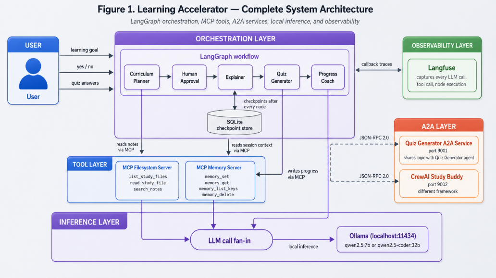

# How to build a Multi-Agent AI System with LangGraph, MCP and A2A

## What we are going to build:
The system we are going to build has four agents coordinated by LangGraph, tow MCP 
servers giving those agents access to external tools, two A2A services that allow 
cross-framework agent delegation, Langfuse capturing full traces, and DeepEval running 
automated quality checks.

Here is what that looks like end to end:


Figure 1. The complete system. LangGraph orchestrates the four agents. Each agent 
accesses tools through MCP. The Progress Coach delegates to external agents via A2A, 
including a CrewAI agent, a different framework entirely. Ollama runs all inference 
locally. Langfuse captures every trace.


## Chapter-1: When to Use Multiple Agents
Before writing any code, we should answer a question that most multi-agent tutorials skip entirely: does our problem actually need multiple agents?

This matters because adding agents has a real cost. More agents means more moving parts, more potential failure points, shared state that can be corrupted from multiple directions, and debugging that requires following execution across process boundaries. A single agent with good tools is often the simpler, faster, and more reliable solution.

So the question isn't "should I use multiple agents?" as though multi-agent is inherently superior. The question is "does my problem have characteristics that justify the coordination overhead?"

### 1.1 When a Single Agent is the Right Answer
A single agent is usually the right architecture when the problem has one primary job that fits in one context window.

An agent that researches a topic and summarizes it: one job, one context window, one agent. An agent that reviews a pull request and posts comments: one job. An agent that answers customer questions from a knowledge base: one job. An agent that extracts structured data from a document: one job.

In these cases, adding a second agent doesn't simplify anything. It adds a coordination layer, a shared state contract, a new failure surface, and debugging complexity, in exchange for no architectural benefit. The single agent does the whole job. You give it good tools and it works.

The flow for a single agent system is pretty straightforward:<br>
`User's Input -> Agent(with tools) -> Response
`
<br>

The agent may call tools in a loop (search, read, write, verify) but a single LLM with the right tool access handles the full task. This is the right starting point for most AI automation work, and it's often the right finishing point too.

### 1.2 The Real Criteria for Multiple Agents
Building a system with multiple AI agents adds extra work—they have to talk to each other, pass messages, and stay on the same page. So, how do you know when it’s actually worth the effort?

The golden rule is simple: Use multiple agents only when a single AI gets overwhelmed by trying to wear too many hats.

Think of it like building a house. You could hire one jack-of-all-trades, but for a great house, you want a specialized architect, a plumber, and an electrician. They each have their own tools, their own way of working, and their own focus.

In AI development, you should split one big AI into a team of specialized agents if you notice two or more of the following signs:

**Different tools for different subtasks**
If you give one AI agent twenty different tools (like the ability to delete files, search the web, calculate math, and write to a database), it easily gets confused. It might pick the wrong tool or get stuck.
- The Fix: Create one "Research Agent" that only knows how to search the web, and a "Database Agent" that only knows how to save files. They do their jobs separately and hand off the results.

Each agent uses only the tools it needs, which means each agent is easier to test and reason about in isolation.

**Different LLM call patterns**
Some tasks need a single structured output call with temperature = 0. Others need a multi-turn tool-calling loop that terminates when the LLM decides it has enough context.

Mixing these patterns in one agent creates a function that does too many different things and fails in different ways depending on which path executes.

- Example: Imagine an AI that writes a blog post. The "Outline Agent" just needs to look at a topic and instantly spit out a clean, structured bulleted list. But the "Writing Agent" needs to write a paragraph, check it, fix it, and try again until it looks good. Mixing these two different styles of thinking into a single AI usually makes it slow and prone to glitching.

**Different temperature and model requirements**
Note: In AI, we use a setting called temperature to control how creative or strict the AI is.

- Low Temperature (0.0): Strict, highly logical, and consistent. Great for grading a math quiz or writing code.

- High Temperature (0.7+): Creative, varied, and unpredictable. Great for writing catchy marketing copy.

* The Problem: A single agent can only have one temperature at a time. If you want an AI to grade a quiz logically and then write a fun congratulatory poem for the student, a single agent will force a compromise—making the grading sloppy or the poem incredibly boring. Splitting them into two agents solves this.

**Fault isolation requirements**
If one subtask can fail without stopping the others, we need a boundary between them. If everything is handled by one giant AI, a single mistake anywhere in the process can ruin the entire run.
- Example: Imagine an AI app that generates a school lesson plan and then creates a practice quiz. If the quiz-maker part of the code breaks because of a temporary glitch, the lesson-planning part shouldn't have to crash too. By separating them into a "Lesson Agent" and a "Quiz Agent," the Lesson Agent can still finish its job perfectly even if the Quiz Agent stumbles.

**Independent deployment needs**
If different parts of the system might need to run at different scales, be updated independently, or be built by different teams using different frameworks, agent separation maps to deployment separation. The A2A protocol makes this concrete.

**Cross-framework collaboration**
If we want to use a CrewAI agent for one task and a LangGraph agent for another, because different frameworks have different strengths, we need a protocol for them to communicate. That protocol is A2A.

- The Takeaway: If your AI project only ticks one of these boxes, stick to a single, simple agent. But the moment you start checking off two, three, or more, it’s time to stop building a single "Super-AI" and start building a team.

### 1.3 The Cost You are Paying
Before you decide to build a team of multiple agents, you need to understand the "hidden taxes" you will have to pay. Building a multi-agent system makes your code significantly more complex.

If you choose this path, here is what it's going to cost you in terms of time, performance, and headaches:

- Shared state complexity: 
In a multi-agent system, all your agents usually read from and write to a single, shared "project file" or memory pool (called the shared state).
    - The Problem: Imagine a group project where three people are editing the exact same Google Doc at the same time without talking to each other. If Agent A writes down bad information, Agent B will read that bad info and use it to do their job, ruining the final result. If Agent A and Agent B try to update the exact same section at the same moment, they might overwrite each other's work.
    
    - The Cost: You have to spend a lot of time writing strict rules to referee how and when agents are allowed to change this shared memory.

- Harder debugging: When a single AI agent makes a mistake, it usually spits out an error message right then and there. It’s easy to find and fix.
   - The Problem: In a multi-agent team, bugs act like a game of telephone. Agent 1 might make a tiny, invisible mistake in step one. Agent 2 reads that mistake and passes an altered version to Agent 3. By the time Agent 4 tries to finish the job, the whole system crashes. When you look at the error message, it looks like Agent 4 broke—but the actual culprit was Agent 1, three steps ago.
   - The Cost: Tracking down the root cause of a glitch takes much longer because the chain of clues crosses between multiple different AIs.

- Latency multiplication: Every single time an AI agent needs to think or use a tool, it has to make a network call to the Large Language Model (LLM). This takes time.
   - The Problem: If a single AI agent takes 3 seconds to answer, that's fine. But if you have a 4-agent system where each agent has to wait for the previous one to finish—and some agents need to go back and forth in a loop—that 3 seconds easily multiplies into 12, 15, or 20 seconds.

   - The Cost: Your users will have to sit and watch a loading spinner for a lot longer.

- More infrastructure: A single AI agent is lightweight; you can often just run it on your laptop inside a simple script, and it works fine.
   - The Problem: A multi-agent system is a complex machine. To run it safely in the real world, you can't just wing it. You need to build a database to save their conversations, set up special monitoring dashboards to watch them work, build "human-in-the-loop" approval buttons so a real person can double-check their handoffs, and create massive testing suites.

   - The Cost: You will spend less time writing core AI logic and more time building the digital plumbing and scaffolding required just to keep the agents running safely.

The Takeaway: Multi-agent architectures are powerful, but they are not free. You should go into it with your eyes wide open. Always ask yourself: "Does the complexity this team solves outweigh the brand new complexity creating them will introduce?"

### 1.4 Why our System Uses Four Agents

The Learning Accelerator uses four agents. Here is the technical justification for each separation – again, not because 
multi-agent is better, but because these four tasks are different enough that combining any two would make the combined 
agent worse at both.


| Agent              | What it does                                                            | Why it's a separate agent                                                                                                                                                               |
| ------------------ | ----------------------------------------------------------------------- | --------------------------------------------------------------------------------------------------------------------------------------------------------------------------------------- |
| Curriculum Planner | Takes a learning goal, produces a structured study roadmap              | One LLM call, `temperature=0.1`, `format="json"`. Zero tools. Fast, deterministic, fails fast on bad input. Mixing tool-calling behavior here would add noise to structured output.     |
| Explainer          | Reads source notes via MCP, explains topics to the student              | Multi-turn tool-calling loop. `temperature=0.3`. Loop count is non-deterministic: the LLM decides when it has enough context. Completely different execution pattern from the Planner.  |
| Quiz Generator     | Generates questions (creative), then grades answers (analytical)        | Two separate LLM calls with different temperatures. Interactive: pauses for user input. Also runs as a standalone A2A service. Can't do this if bundled with another agent. |
| Progress Coach     | Synthesizes results, updates topic status, routes to next topic or ends | Makes the only cross-agent A2A call (to the CrewAI Study Buddy). Reads and writes MCP memory. Manages the routing decision that determines whether the graph loops or ends.             |

The Curriculum Planner and Explainer alone justify separation: one does structured JSON output with no tools, the other does 
a multi-turn tool-calling loop. Putting these in one agent means one function that sometimes calls tools in a loop and 
sometimes doesn't, at different temperatures, returning different types of output. That's not one agent with a broad 
capability. That's two agents pretending to be one.

The Quiz Generator's dual-temperature pattern (creative question generation at 0.4, analytical grading at 0.1) and its need 
to run as a standalone A2A service make the case for its own boundary.

The Progress Coach is the coordinator. It synthesizes everything and makes the routing decision, which is exactly the wrong job to share with any other agent.

This is the pattern worth looking for in your own problems: if you can't explain why two tasks should be the same agent, they probably shouldn't be.

The same reasoning applies in production systems. A compliance training platform has a curriculum agent (builds the certification path), a content delivery agent (presents regulatory material from a content MCP server), an assessment agent (tests comprehension, records results), and a certification agent (evaluates readiness, issues certificates).

Each has different tools, different failure modes, and different update cadences. The separation isn't architectural philosophy. It's the direct consequence of what each task needs.


### Tips:
**Identity Crisis**
Start by assuming your system is one single agent. Look at the tasks it needs to do. Does that single agent start having an identity crisis?
You need to split into different agents if you can check off two or more of these flags:
- The Tool Explosion Flag: Does the agent need more than 4–5 completely different tools? (e.g., if it needs to write SQL queries, delete files, scrape LinkedIn, and generate images, it will get confused. Give those tools to separate, isolated agents).
- The Temperature Split Flag: Do parts of the task need to be completely rigid (Temperature 0.0 for math, JSON coding, parsing) while other parts need to be highly creative (Temperature 0.7 for marketing copies, brainstorming)? A single agent can only run at one temperature at a time.
- The Routine Switch Flag: Does one part of the job require a lightning-fast "one-and-done" response, while another part requires a loop that keeps running until the AI is satisfied?
- The Blast Radius Flag: If a minor subtask fails (like a weather API being down), will it crash the mission-critical core logic? If yes, separate them so the core agent has a safety boundary.

**The A2A(Agent to Agent) Filter**
Once you've decided you need multiple agents, how do they talk to each other? Most framework tools (like LangGraph) let agents share memory automatically inside the same script.

You only need to upgrade to A2A communication protocol if you meet these specific organizational boundaries:

```text
┌──────────────────────────────┐
│ Do I need different agents?  │
└──────────────┬───────────────┘
               │ Yes
               ▼
┌───────────────────────────────────┐
│   Do they cross a "Boundary"?     │
└─────────────────┬─────────────────┘
                  │
   ┌──────────────┴───────────────────────────────────┐
   ▼ Yes                                              ▼ No

┌──────────────────────────────┐     ┌──────────────────────────────┐
│     Use A2A Protocol         │     │    Use Standard Framework    │
│  (Independent microservices) │     │   (Shared state / internal)  │
└──────────────────────────────┘     └──────────────────────────────┘
```
Here is the boundaries:

- `Boundary 1`: Cross-Framework Collaboration. You want to build Agent A using CrewAI (because it handles roleplay and web scraping beautifully), but Agent B needs to be built in LangGraph (because you need strict state-machine control over loops). They cannot share code natively, so they must use A2A to send messages to each other.

- `Boundary 2`: Standalone Service / Reusability. Will this specific agent be useful to other software applications in your company? For example, if you build a "Compliance Grading Agent", and tomorrow the HR mobile app and the internal web portal both want to use it independently, it should be an A2A service. It runs on its own server and accepts incoming agent requests.

- `Boundary 3`: Team & Deployment Scale. Are two different teams building these agents? If Team Alpha updates the "Payment Agent" on a Tuesday, they shouldn't have to redeploy Team Beta's "Inventory Agent." If they are deployed completely independently on different servers, they must communicate via A2A.

